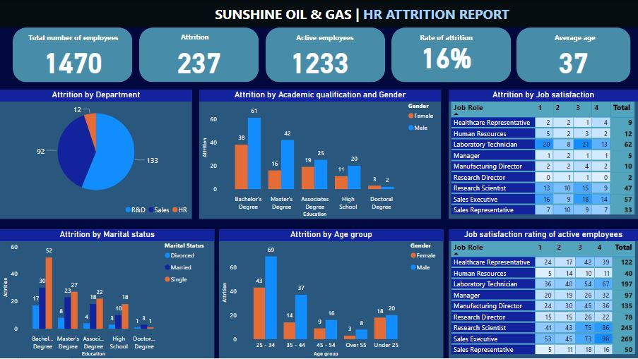
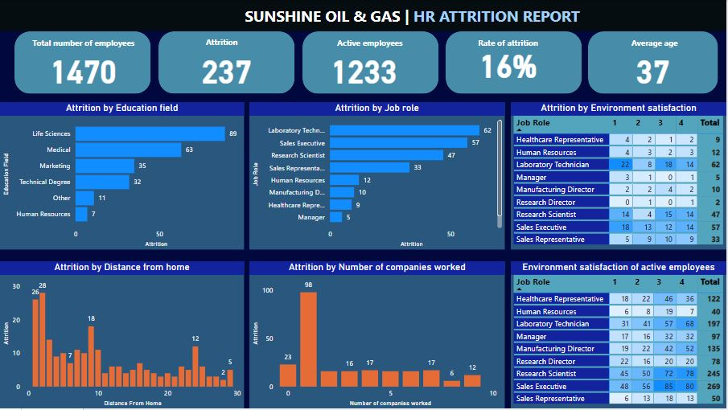

# 
 SUNSHINE ATTRITION ANALYSIS 

# 

## 
 Introduction 

In this project, we delve into the dynamics of employee attrition within Sunshine Oil and Gas, utilizing data encompassing various facets of employee demographics, job-related factors, and satisfaction levels. By analyzing factors such as gender, age, job role, education field, marital status, distance from home, job satisfaction, environmental satisfaction, employment history, and education level, we aim to uncover insights that can inform strategies to mitigate attrition and foster a more engaged and satisfied workforce.
## 
 Aims and objectives 

- Identify key factors contributing to employee attrition within Sunshine Oil and Gas by analyzing the distribution of employment statuses and exploring demographic and job-related trends.
- Assess the impact of job satisfaction, environmental satisfaction, distance from home, prior employment history, and educational background on attrition rates.
- Determine the demographic breakdown of the employee population, including gender, age, marital status, and education level, and examine their correlation with attrition.
- Explore the distribution of job roles and fields of education among employees and investigate their association with attrition.
- Conduct statistical tests to identify significant correlations between job satisfaction, environmental satisfaction, and attrition, and analyze spatial patterns to understand the relationship between distance from home and attrition rates.
- Evaluate the influence of prior employment history (number of companies worked before) and the highest level of education attained on attrition within the company.
## 
 Problem statement 

Despite being a prominent player in the energy sector, Sunshine Oil and Gas is experiencing a concerning rate of employee attrition. This phenomenon poses a significant challenge to the company's operational stability, employee morale, and long-term growth prospects. To address this issue effectively, it is imperative to gain a comprehensive understanding of the underlying factors contributing to attrition within the organization. By analyzing employee demographics, job-related variables, and satisfaction levels, this study aims to identify the root causes of attrition and propose actionable insights to mitigate its impact, improve retention strategies, and foster a more engaged and stable workforce.
## 
 Data sourcing 

This project is focused on analyzing employee attrition within an imaginary company called Sunshine Oil and Gas. The dataset for this analysis was sourced online and it contains information on employee demographics, job-related variables, and satisfaction levels.
## 
 Data cleaning and transformation 

For data visualization, I employed Power BI, utilizing its Query Editor functionality for data cleaning.. Some of the applied steps includes the following;
- used first row as header
- reviewed each column to ensure it was in the appropriate data type. Any columns found to be in the wrong data type were corrected to the right data type.
- added a conditional column.
# 

## 
 Data visualization 

I utilized Power BI exclusively for data visualization purposes. Leveraging its robust visualization features, I created insightful charts, graphs, and interactive dashboards to represent key insights derived from the dataset provided.
# 

# 

# 
 Insights from data 

- The total number of employees at Sunshine Oil and Gas is 1470, with 1233 currently active and 237 having experienced attrition. This indicates an attrition rate of 16%. Additionally, the average age of employees is 37.
- Among the 237 employees who experienced attrition, 133 were from the Research & Development (R&D) department, 92 were from the Sales department, and 12 were from Human Resources (HR).
- Among employees who experienced attrition, those with a bachelor's degree had the highest attrition rates, with 61 males and 38 females while those with doctoral degrees have the lowest attrition rate with 2 males and 3 females. This could be attributed to reasons such as employees leaving to seek greener pastures, pursue higher academic qualifications, or explore better career opportunities elsewhere.
- Also from the data, a total of 150 male employees and 87 female employees left the company. This suggests that attrition rates among male employees are higher compared to female employees.
- Among employees who experienced attrition, the highest number were single, totaling 120 employees, followed by married employees, with 84 employees, and the lowest were divorced employees, with 33 employees. Possible reasons for this could be because the single employees might be more inclined to explore new career opportunities or relocate for personal reasons, such as pursuing further education or seeking better work-life balance. Also, married employees may face pressure to seek more stable employment or relocate less frequently due to family commitments, which could contribute to lower attrition rates compared to single employees and then the divorced employees might experience higher levels of stress or dissatisfaction in their personal lives, potentially impacting their job satisfaction and contributing to higher attrition rates.
- Among employees who left the company, the highest number falls within the age group of 25-34, totaling 112 employees, while the lowest number is in the over 55 age group, with only 11 employees. Employees in the younger age group may be more likely to seek new opportunities for career growth, better compensation, or improved work-life balance while the older age group may be approaching retirement; and they may also leave the company due to health reasons, personal obligations, or a desire for reduced workload.
- Analysis of the data reveals that laboratory technicians and sales executives have the highest number of employees who report being least satisfied with their job. This dissatisfaction likely contributes to the higher attrition rates observed within these job roles.
- The data indicates that the highest number of employees who experienced attrition reside within one or two kilometers from the company. A possible reason for this trend could be the presence of industrial waste produced by the company, creating an unfavorable environment for employees and necessitating their relocation, ultimately leading to attrition from the company.

# 
 Recommendation 

- Tailoring retention strategies to address the unique needs and challenges of each department can help mitigate attrition rates. Additionally, fostering a culture of open communication and providing opportunities for career growth and development within each department may enhance employee satisfaction and retention.
- To address attrition rates among employees with bachelor's degrees, consider implementing targeted retention strategies such as career development programs, mentorship initiatives, and opportunities for advancement. Additionally, conducting surveys or focus groups to gather feedback from employees with bachelor's degrees can help identify specific areas for improvement in their work experience and job satisfaction. For employees with other academic qualifications, tailor retention efforts based on their unique needs and preferences, ensuring that all employees feel valued and supported in their roles.
- To address the higher attrition rates among male employees, consider conducting targeted surveys or exit interviews to gain insights into the specific reasons driving their departure. Additionally, implementing initiatives such as flexible work arrangements, leadership development programs, and employee recognition schemes may help improve male employee retention. Furthermore, fostering a supportive work culture that values diversity and inclusion can contribute to increased employee satisfaction and reduced turnover among both male and female employees.
- To address attrition among single employees, consider implementing programs or benefits that cater to their unique needs, such as flexible work arrangements or career development opportunities. For married employees, initiatives focused on improving work-life balance and providing support for family responsibilities could help reduce attrition rates. Additionally, offering resources for coping with personal challenges or providing counseling services may benefit divorced employees and contribute to higher retention rates overall.
- To address attrition among employees aged 25-34, consider implementing retention strategies such as career development programs, mentorship initiatives, and opportunities for advancement. Providing competitive compensation packages and work-life balance benefits may also help retain younger employees.
- To address job dissatisfaction among laboratory technicians and sales executives, consider implementing measures to improve their work environment, such as providing opportunities for skill development, offering performance-based incentives, or enhancing recognition programs.
- To address the potential impact of environmental factors on employee attrition, consider conducting environmental assessments to identify and mitigate any issues contributing to employee dissatisfaction or health concerns. Implementing measures to improve environmental sustainability, such as waste management initiatives or pollution control measures, can help create a safer and healthier workplace environment. Additionally, providing support for employees affected by environmental factors, such as relocation assistance or remote work options, can help mitigate attrition rates and foster employee retention.

# 
 Conclusion 

